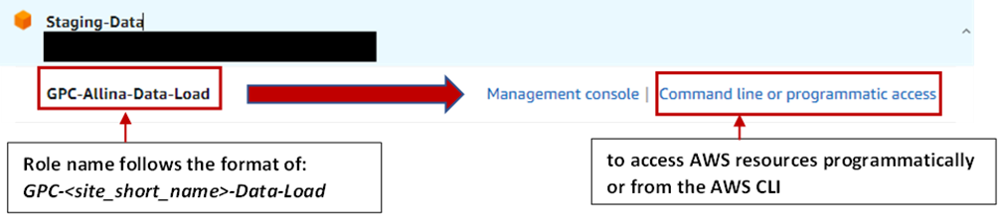

# GPC DVINCI Data Linkage Pilot Project
## Overview
As one of the contractual milestones for PCORnet Phase 3, GPC will advance Datavant tokenization of the Veterans Administration (VA) and Department of Defense (DoD) electronic health records to support linkage across PCORnet and the corresponding Governance processes. Leveraging existing inter-network resources and in support of the [brain injury data sharing (BIDS)](doc/GPC_LEC_2022_BIDS-VA-Linkage.pptx) project, we propose a demonstration linkage project between GPC EHR data and DoD/VA EHR data (i.e., the DaVinci database) to advance the understanding of treatment, progression and long-term outcomes of traumatic brain injury (TBI) for Servicemembers and Veterans.

Participating sites will need to maintain [Datavant®](https://datavant.com/) software for generating GPC-specific hash token used for linking with VA health data in support of the proposed overlapping analysis. The overlapping analysis will perform first on the entire GPC population, and then on a subset of overlapping TBI population. Overlapping analysis will be performed on DaVinci database and **results will be disseminated to sites**. This pilot project is to set the stage for future collaborations and funding opportunities between GPC and VA.   

Key Contacts: 
- Leading site PI: Dr.Jacob Kean <jacob.kean@hsc.utah.edu>
- Coordinating site PI: Dr.Xing Song <xsm7f@umsystem.edu>
- Project Manager: Vyshnavi Paka <vpknx@umsystem.edu>

There are several analytic angels under discussion right now with a goal to pursue funding opportunities: 
- identify potential care gaps for the GPC-VA crosswalk population using DaVINCI database with a focus on TBI and ALS. 
- use definite linkage as referential data to validate CDM-based payor type identification.   
- predictive modeling for VA stauts using private sector data

We currently host bi-weekly calls to check-in on project progess and discuss collaboration opportunities. For any GPC researcher who may be interested in the topics above or GPC-VA data in general, you are welcomes to join the call and brainstorm. Please reach out to Vyshnavi to add you to the bi-weekly meeting series.  

****************************************************************************

## Scope of Work Overview
- **milestone 1**: Administrative preparation: GPC EICA execution, Datavant order form, IRB or non-human-determination, GPC DROC request
- **milestone 2**: Hash Token Generation and Submission: Performing sites will submit GPC-specific hash token table to the GPC CC cloud environment securely
- **milestone 3**: Linkage mapping generation: Coordinating site will aggregate hash token tables, perform deduplication and coordinate with leading site and VA to generate linkage mapping
- **milestone 4**: Analysis and Result Dissemination: Authorized analysts at leading site will perform overlapping analysis to assess the validity and utility of the linked dataset, and will dissemintate results back to participating sites.

****************************************************************************

## Administrative Preparations

- GPC EICA executed with VA as an external partner: [Executed GPC EICA](doc/1.%20FSS%20License%20Agmt%20to%20WH-CSPCC_Clean%2022%20November%202022%20for%20CO%20Portal%20-%20VA%20OGC%203.24.23_update_signedJK.pdf)

- As an extension of the BIDS project, a no-cost and no-signature Datavant order form has been officially executed for the linkage work. Sites can download the executed order form for local reference from: [Executed Datavant Order Form](doc/Final%20BIDS%20DaVINCI%20GPC%20Linkage%20Order%20Form_v2%20(002)%20FE.pdf)

- The scope of work (SOW) with site budget can also be downloaded from: [SOW with Site Budget](doc/SOW-SiteBudget-v5.docx)     

- Non-human subject derermination letters have been obtained from IRBs of both the leading site (University of Utah) and coordination site (University of Missouri)

|Site Role|Site PI|Site Name|NHS Application|
|---------|-------|---------|----------|
|Leading site|[Dr.Jacob Kean](https://medicine.utah.edu/faculty/mddetail/u6002766)|University of Utah|[NHS-Kean-UU](doc/NHS-Kean-UU.pdf)|
|Coordinating site|[Dr.Xing Song](https://medicine.missouri.edu/faculty/xing-song-phd)|University of Missouri|[NHS-Song-MU](doc/NHS-Song-MU.pdf)|

- A GPC DROC request has been submitted under the type of "GPC de-identified line-item data request". 

- Given that the nature of the project is using Datavant technology to generate de-identified hash token which will be shared with us , and there is no way to re-identify the individuals, this project has been determined as Non-human-subject project by both the University of Utah IRB and MU IRB. De-identified line-item data sharing is covered by the current active GPC DSA. 

- For sites needing their own IRB or additional review, the following are information that could be helpful based on sites' feedback
<table>
<tbody>
    <tr>
        <th>Question</th>
        <th>Answer</th>
    </tr>
    <tr>
        <td> 1. Who are contained in the token? </td>
        <td> - All patients contained in the most recently approved PCORnet CDM. </td>
    </tr>
    <tr>
        <td> 2. Who will be accessing the data? </td>
        <td> - GPC CC will recieve the hash token table, aggregate them and send to VA Linkage Team 2 for linkage and overlapping analysis. PIs of leading site and coordinating site and their sponsored informatics/analytics personnel, as well as VA linkage team 2 will have access to the de-identified hash token table. </td>
    </tr>
    <tr>
        <td> 3. Is there additional CDM table needed besides tokens?  </td>
        <td> - No. Only de-identified hash token table needs to be delivered to GPC CC </td>
    </tr>
    <tr>
        <td> 4. Will I need external data sharing committee review? </td>
        <td> - At both Utah and MU, this project has been determined as Non-Human-Subject research, as the encrypted hash token table is considered de-identified data. </td>
    </tr>
    <tr>
        <td> 5. What data will be extracted for the crosswalk population from DaVINCI database? </td>
        <td> - Demographic, diagnosis, procedures, visits, and other relevant clinical observations in limited dataset format to understand potential care gaps. </td>
    </tr>
    <tr>
        <td> 6. Will this `gpc_va` token be used to reproduce the linkage or re-idenfity the patients in the future? </td>
        <td> - No. There will be new study-specific transit token generated for new projects involving GPC-VA linkage </td>
    </tr>
</tbody>
</table>

- *Payment schedule*: As described in the executed [Datavant order form](doc/Final%20BIDS%20DaVINCI%20GPC%20Linkage%20Order%20Form_v2%20(002)%20FE.pdf) Appendix D, 100% of the funds will be released from Datavant to GPC at linkage completion, which will then be distributed to sites at completion of milestone 1, 2 and 3. 


************************************************************************

## Participating Sites Workflow


As entailed in the data flow figure above, sites are only required to complete Step 1. For full transparency and document completion, we will describe the entire workflow below: 

### Step 1: Data Tokenization and Submission (*at GPC-Site*) - Due on 02/01/2023
#### Step 1.1 (Tokenization)         
Assume that sites have all generated the [site-specific token](https://datavant.com/wp-content/uploads/dlm_uploads/2018/09/WhitePaper_-De-Identifying-and-Linking-Structured-Data.pdf) based on the same configuration as PCORnet hash tokens (tokens 1,2,3,4,5,16). PCORnet site-specific tokens generated previously can be further converted to `gpc_va` study-specific transit tokens, by running the following command in cooresponding operation system where datavant executable is installed. You will need to specify the following parameter before running the command: 
- \<yoursitedvkey\>: is the name key of your site specified in the Datavant portal. Please note that site-specific tokens are not the transit tokens sent to PCORnet. PCORnet transit tokens cannot be converted to `gpc_va` transit tokens.   
- \<credentials\> or \<credentials.txt\> file: is your user-specific credentials, retrieved from the Datavant portal and stored in a plain text file in the required location
- \<yoursitenameabbr\>: is your site-specific abbreviation (e.g., 'UMO' for 'University of Missouri', this is in line with PCORnet abbreviations) to separate your hash token file from the others. 

*Windows*
```bash
cat credentials.txt | .\Datavant_Win.exe transform-tokens --to gpc_va -s <yoursitedvkey> -i tokenization_input.csv -o tokenization_output_<yoursitenameabbr>.csv --credentials
```

*Mac*
```bash
cat credentials | .\Datavant_Mac transform-tokens --to gpc_va -s <yoursite> -i tokenization_input.csv -o tokenization_output_<yoursitenameabbr>.csv --credentials
```

*Linux*
```bash
cat credentials | .\Datavant_Linux transform-tokens --to gpc_va -s <yoursite> -i tokenization_input.csv -o tokenization_output_<yoursitenameabbr>.csv --credentials
```

#### Step 1.2 (Submission)        
1. **Login with Data-Load role**: go to <https://umbmi.awsapps.com/start#/> (Single-Sign-On portal), and log in to the AWS Management Console by selecting the “Management Console” next to your pre-defined role (`GPC-XXX-Data-Load`). Note that you will be required to put in MFA codes every time log into the AWS account. Any other roles will not guarantee access to the designated upload buckets (you may run into `access denied` error if using the wrong role). 

2. **Upload data to designated bucket**: you will than follow either of the processes described below. Note that both processes use TLS/SSL secure protocols: 

- option a): Submit to their **site-specific upload buckets** via your site-specific submission url. **After logged in from the SSO portatl, instead of navigating to S3 bucket, you will need to open a different brower and directly paste the designated s3 bucket url to go directly to the desingated s3 bucket. 

| **GPC Site** | **S3 Bucket URL**                                                  |
|--------------|--------------------------------------------------------------------|
| Allina       | https://s3.console.aws.amazon.com/s3/buckets/gpc-allina-upload/    |
| IHC          | https://s3.console.aws.amazon.com/s3/buckets/gpc-ihc-upload/       |
| KUMC         | https://s3.console.aws.amazon.com/s3/buckets/gpc-kumc-upload/      |
| MCRI         | https://s3.console.aws.amazon.com/s3/buckets/gpc-mcri-upload/      |
| MCW          | https://s3.console.aws.amazon.com/s3/buckets/gpc-mcw-upload/       |
| UTHSCSA      | https://s3.console.aws.amazon.com/s3/buckets/gpc-uthscsa-upload/   |
| UTSW         | https://s3.console.aws.amazon.com/s3/buckets/gpc-utsw-upload/      |
| UNMC         | https://s3.console.aws.amazon.com/s3/buckets/gpc-unmc-upload/      |
| UU           | https://s3.console.aws.amazon.com/s3/buckets/gpc-uu-upload/        |
| UIOWA        | https://s3.console.aws.amazon.com/s3/buckets/gpc-uiowa-upload/     |
| UTHouston    | https://s3.console.aws.amazon.com/s3/buckets/gpc-uthouston-upload/ |
| WashU        | https://s3.console.aws.amazon.com/s3/buckets/gpc-washu-upload/     |

option b): Using AWS CLI to upload data to site-specific bucket. More specifically, 
- grab role credentials from **command line or programmatic access** to authenticate and authorize



- `aws s3 ls s3://{upload-bucket-name}` -- list commands to see current objects under the designated bucket
- `aws s3 cp <path-to-file> {upload-bucket-name}` -- to copy single file into the designated bucket

| **GPC Site** | **{upload-bucket-name}**  |
|--------------|---------------------------|
| Allina       | `gpc-allina-upload`       |
| IHC          | `gpc-ihc-upload`          |
| KUMC         | `gpc-kumc-upload`         |
| MCRI         | `gpc-mcri-upload`         |
| MCW          | `gpc-mcw-upload`          |
| UTHSCSA      | `gpc-uthscsa-upload`      |
| UTSW         | `gpc-utsw-upload`         |
| UNMC         | `gpc-unmc-upload`         |
| UU           | `gpc-uu-upload`           |
| UIOWA        | `gpc-uiowa-upload`        |
| UTHouston    | `gpc-uthouston-upload`    |
| WashU        | `gpc-washu-upload`        |


If more technical details are needed or you would like to request a working session with GPC CC, please reach out to ask-umbmi@umsystem.edu or create an issue at https://github.com/gpcnetwork/gpc-va-linkage/issues. 


### Step 2: Token Integration and Transfer (*at GPC-CC*) - Due on 04/01/2023       
#### Step 2.1 (Integration)     
GPC CC will extract all `tokenization_output_<yoursitenameabbr>.csv` files, add de-identified site ID and integrate as one single tokenization file before sending over to VA linkage team for crosswalk generation. 

#### Step 2.2 (Transfer)        
GPC CC will submit the integrated hash token file via secure file transfer to VA linkage hub team (VA Team 2). GPC CC will upload the aggregated finder file to a designated secure S3 bucket for VA Team 2 to download. A restricted data downloader role will be created for one VA personnel approved for the project. 

### Step 3: Linkage and Overlap Analysis (*at VA*) - Due on 08/01/2023     
#### Step 3.1 (Linkage)         
VA tokenization team (VA Team 1) will perform data tokenization on DaVINCI data using study-specific key `gov_va_lhb_gpc` and submit the VA hash tokens to VA linkage hub team (VA Team 2) for crosswalk generation. VA Team 2 will then send the matched patient IDs back to GPC CC. 

#### Step 3.2 (Analysis)        
VA team and GPC CC will perform overlap analysis and disseminate results back to sites. The analysis results can be used as preliminary data to support future grant proposals.  

************************************************************************
*Copyright (c) 2022 The Curators of University of Missouri*</br>
*Share and Enjoy according to the terms of the MIT Open Source License*</br>
*Repo structure style follows [GitHub Repository Structure Best Practices](https://soulaimanghanem.medium.com/github-repository-structure-best-practices-248e6effc405) (Ghanem, 2021)*


