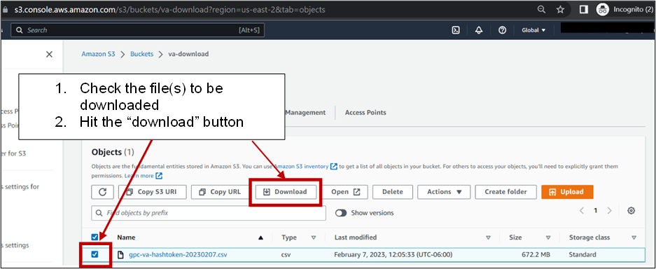

# Account Initialization

After your AWS account being created using organizational email (e.g. user@umsystem.edu), you will receive an invitation email from AWS for setting up password, Multifactor Authentication (MFA) as well as initial access to the AWS Single-Sign-On (SSO) portal at: 

> https://umbmi.awsapps.com/start#/

Please contact [<u>ask-bmi-prod@umsystem.edu</u>](mailto:umbmiaws-prod@umsystem.edu) if you have any questions or technical issues. 

# Role-based Account Access

Once the user account is initialized and activated, you can access your account from the [AWS SSO portal](https://umbmi.awsapps.com/start#/) with MFA authentication required each time. Click the `AWS Account` and then `Staging-Data` account, you will see the following two options for accessing the s3 bucket resource: 

- Management console: web-based interface
- Command line or programmatic access: role credentials for accessing aws resources using aws command line

# Data Download Process
## Option A - AWS Management Console
1. If you choose to access s3 download bucket on management console, please first double check on the right upper corner of the page that your Role is correct and make sure that you are in the **us-east-2 ohio** region 

2. Open another web browser tab and enter the following URL which will directly prompt you to the designated S3 console for data dowload. 

> https://s3.console.aws.amazon.com/s3/buckets/va-download/

**Important note: DO NOT directly navigate to S3 bucket from management console as the data downloader role do not have the privilege to list all the s3 bucket within the staging-data account**. 

3. Download the aggregated hash token csv file named `gpc-va_dv-hash-token_<most-recent-date>.csv` directly from the console: 

If there are multiple files in the bucket, you can easily identify the more recent one by sorting by `last modified` field. 

## Option B - AWS Command Line
1. Following instructions to get the role credentials from clicking the `command line or programmatic access` tab 
2. Run `aws s3 ls s3://va-download/` to view all objects stored in the bucket, or `aws s3 ls s3://va-download/ --resursive | sort` to view objects sorting by date
3. On your local machine, navigate to a secure location for storing the hash token file
3. Run `aws s3 cp s3://va-download/gpc-va_dv-hash-token_<most-recent-date>.csv` to download the object

Notification of either successful or failed download will be displayed in both management console or command line window. Please report any issue at: https://github.com/gpcnetwork/gpc-va-linkage/issues

